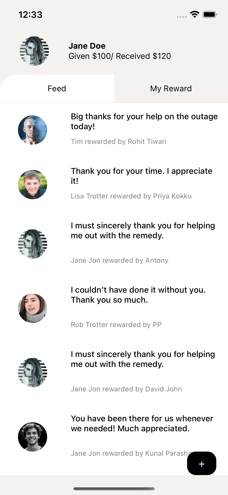

# altir

## Get started
* clone https://github.com/trinadhkoya/altir.git
* go to root folder of project and run the command `yarn install`
* if you are on Mac M1, run `yarn pod` which will help you to install pods on your iOS
* finally run `yarn ios` to see the demo in action

### Covered and WIP:
1. Feed Page ✅
2. My Rewards Page ✅
3. Input Form 

#### Screenshots

<table>
  
  <tr>
    <td></td>
    <td></td>
  <tr>
 

</table>

##### NOTE
I have not tested this on android for time being. Please let me know if in case if you find any issues

###### Author:
trinadhkoya

Portfolio: <a href='https://trinadhkoya.dev'>trinadhkoya.dev</a>
<td>

</td>
